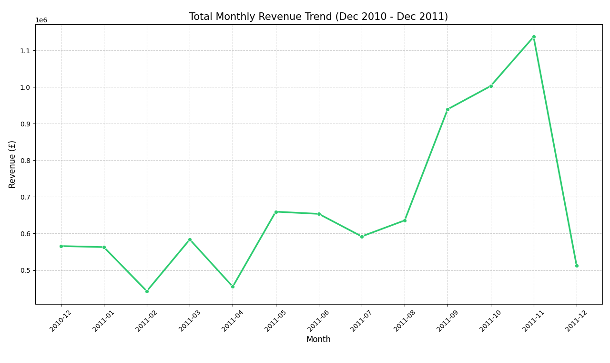
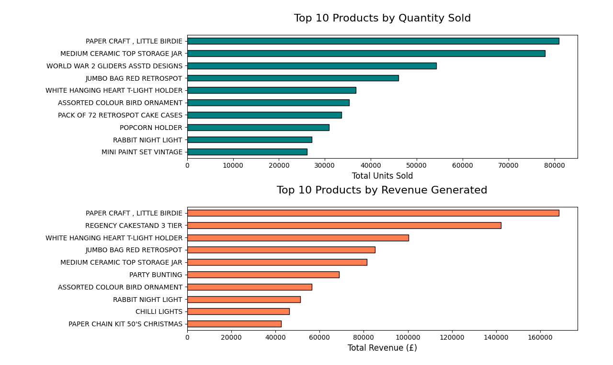
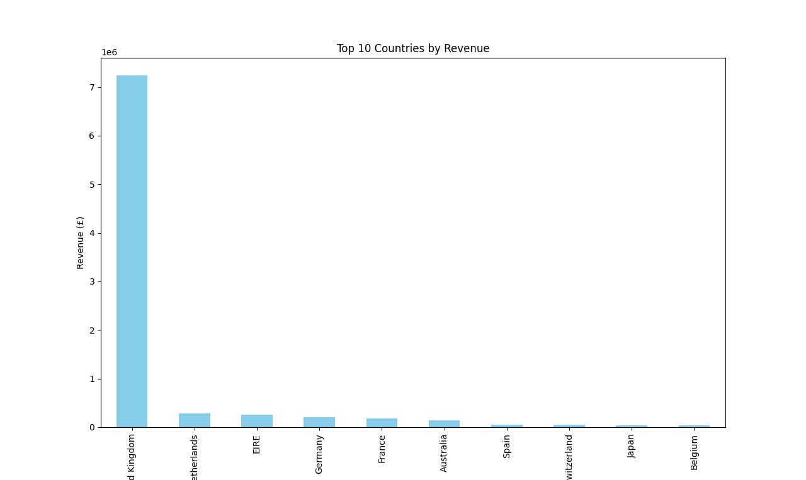
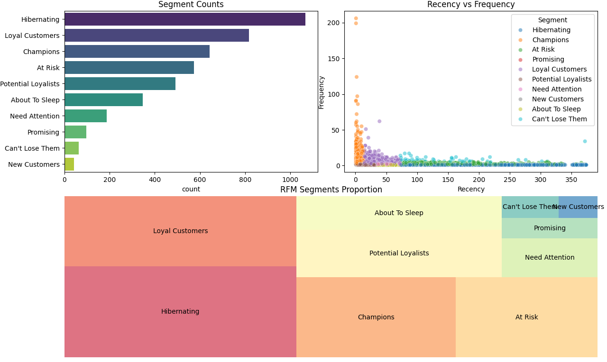

# Online Retail Customer Segmentation & Business Analytics

## 📌 Project Overview
The Online Retail Customer Segmentation project focuses on analyzing real-world e-commerce transaction data to extract meaningful business insights. The main objective is to understand customer purchasing behavior, identify sales trends, and segment customers based on their buying patterns.
Using **RFM (Recency, Frequency, Monetary) Analysis**, customers are grouped into different segments such as champions, loyal customers, and inactive users. This segmentation helps businesses design targeted marketing strategies, improve customer retention, and increase overall revenue.
The project also includes data cleaning, exploratory data analysis, and visualizations to better understand product performance, revenue distribution across countries, and seasonal sales patterns.

## 📊 Key Findings
- **Seasonality:** A massive revenue spike was observed in **November**, likely due to wholesalers stocking up for the holiday season.
- **Market Dominance:** The **UK** is the primary revenue driver, but the Netherlands and EIRE show high potential as international markets.
- **Top Product:** "PAPER CRAFT, LITTLE BIRDIE" is the star performer, leading in both volume and total revenue.
- **Customer Health:** The RFM model identified a significant number of **Champions** and **Loyal Customers**, but also highlighted a large group of **Hibernating** users who need re-engagement.

## 🛠️ Tech Stack
- **Language:** Python 3.x
- **Libraries:** - `Pandas`: Data cleaning and transformation.
  - `Matplotlib` & `Seaborn`: Advanced data visualization.
  - `Squarify`: For creating the RFM Treemap.
  - `Datetime`: For time-series and recency calculations.

## 🧼 Data Cleaning Pipeline
Raw data is often "dirty." This project includes a robust cleaning process:
- **Duplicates:** Removed redundant entries to ensure data integrity.
- **Missing Values:** Dropped records without `CustomerID`.
- **Cancelled Orders:** Filtered out invoices starting with 'C'.
- **Non-Product Codes:** Removed non-inventory items like 'POST', 'BANK CHARGES', and 'DOT'.
- **Outliers:** Kept only positive `Quantity` and `UnitPrice` values.
- **Standardization:** Unified product descriptions by stripping whitespace and converting to uppercase.

## 📈 Visualizations & Analysis

### 1. Monthly Revenue Trend
Visualizing how revenue fluctuates over time to identify peaks and troughs.

### 2. Product & Geographic Analysis
Identifying where the money comes from and which items are flying off the shelves.

### 3. RFM Customer Segmentation
Segmenting customers based on their buying behavior:
- **Recency:** Days since last purchase.
- **Frequency:** Total number of unique orders.
- **Monetary:** Total spending.

## 🚀 How to Run
1. Clone the repository:
   git clone [https://github.com/shradhaa_singh/Online-Retail-Customer-Analytics.git](https://github.com/shradhaa_singh/Online-Retail-Customer-Segmentation.git)

2. Install the required libraries:
    pip install pandas matplotlib seaborn squarify

3. Place data.csv in the project folder.

4. Run
    python main.py

## 📊 Dataset

The dataset used in this project is the Online Retail Dataset, which contains transactional data from a UK-based online retail store.
It includes information such as:
- Invoice Number
- Product Description
- Quantity
- Invoice Date
- Unit Price
- Customer ID
- Country
The dataset represents real-world e-commerce transactions between 2010 and 2011.

**Source**
Kaggle
https://www.kaggle.com/datasets/carrie1/ecommerce-data

The dataset is commonly used for data analysis, customer segmentation, and machine learning projects.

## 💡 Future Improvements

- Build an Interactive Dashboard
- Deploy the Project
- Apply Machine Learning Clustering Methods
- Create a Customer Recommendation System

made with ❤️ by Shradha Singh